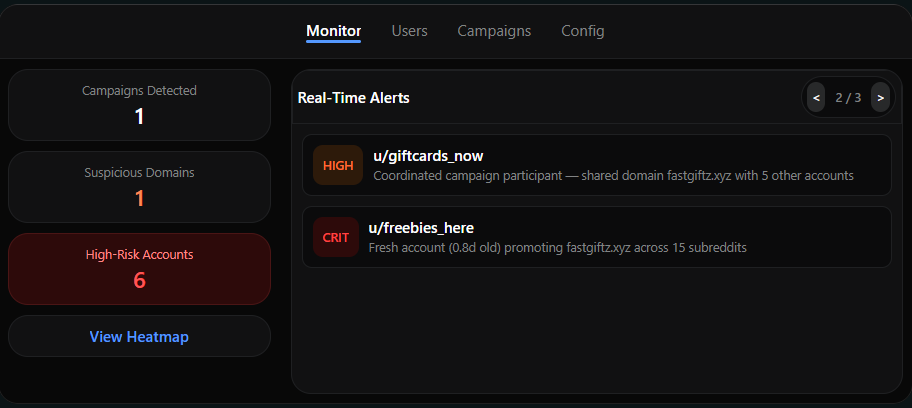
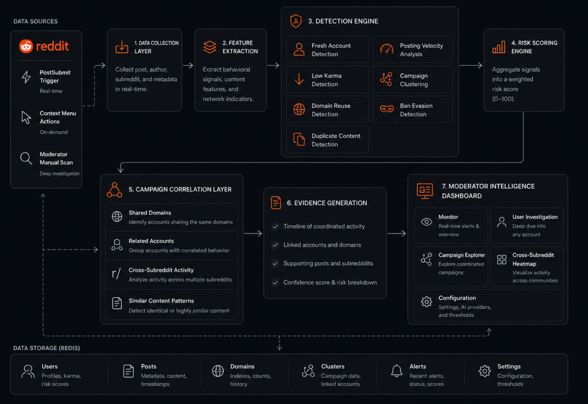
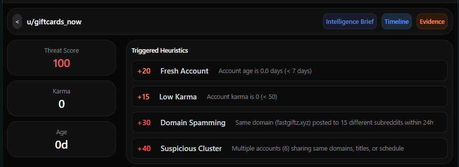
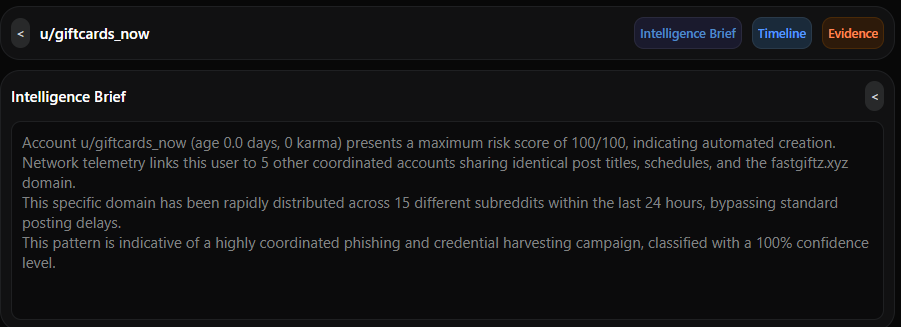
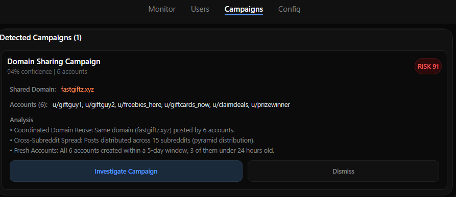
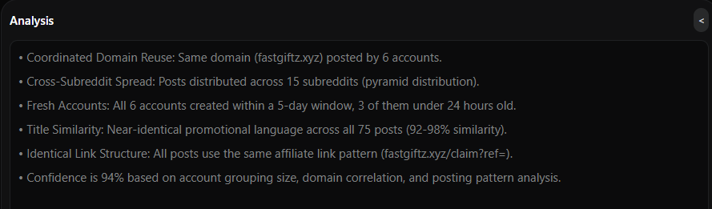
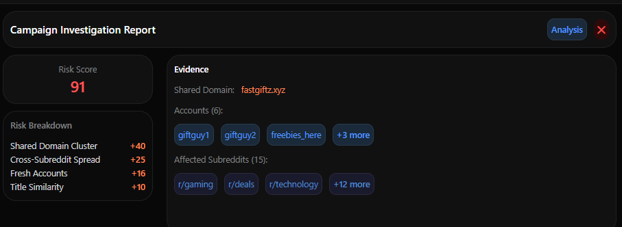
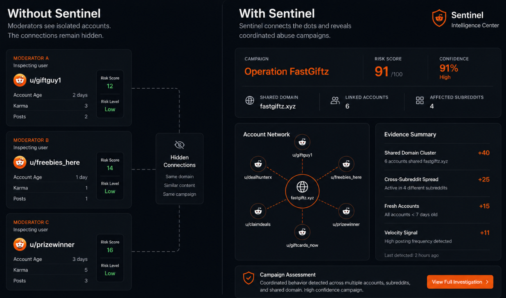

<div align="center">
  

  
  ### Coordinated Intelligence for Reddit Moderators


  
  
  
  

  **Spam is easy to catch. Coordinated abuse isn't.**

  Sentinel shifts Reddit moderation from reacting to individual posts
  
  → detecting entire abuse campaigns.

  
</div>

---

## The Problem

Reddit's existing tools answer one question: *"Is this post suspicious?"*

But modern abuse doesn't operate post by post. Spam rings, affiliate networks, karma farms, repost groups, and ban-evasion clusters are **designed to look legitimate in isolation**. The signal only emerges when activity is analyzed across accounts, content, domains, and communities simultaneously.

That investigation process is manual, time-consuming, and impossible to scale.


## The Solution

Sentinel is a **Devvit-powered moderation intelligence platform** that detects coordinated abuse campaigns across Reddit communities in real time.

Instead of flagging individual accounts, Sentinel maps **relationships** - between accounts, content, domains, posting patterns, and subreddits - to surface entire abuse networks before they spread.

> **Sentinel doesn't moderate content. It exposes campaigns.**




## How It Works

### 1 · Monitor Emerging Threats


Sentinel continuously analyzes community activity and surfaces threats on a live dashboard:

- Suspicious accounts with transparent risk scores
- Active campaigns grouped by shared behavior
- Risky domains being recycled across subreddits
- Cross-community abuse signals as they emerge

---

### 2 · Investigate Any Account




Every account receives a **transparent risk score** built from multiple signals. Moderators always see *why* an account was flagged - no black boxes.

| Signal | What It Catches |
|--------|----------------|
| Fresh Account | Throwaway and newly created accounts |
| Low Karma | Low-trust users flying under the radar |
| Domain Reuse | Link-spam campaigns recycling the same domains |
| Duplicate Content | Coordinated reposts and copy-paste abuse |
| Posting Velocity | Automation bursts and spam floods |
| Campaign Clustering | Accounts linked to known abuse rings |
| Ban-Evasion Similarity | Suspicious username pattern matches |

---

### 3 · Discover Coordinated Campaigns



Sentinel automatically clusters related accounts into **named campaigns** using:

- Shared domains and external links
- Similar or duplicate content fingerprints
- Behavioral and timing correlation
- Cross-subreddit posting patterns

Each campaign surfaces:
- All linked accounts
- All affected communities
- Full evidence trail
- Confidence score
- Investigation timeline

---

### 4 · Understand Campaign Impact



Cross-subreddit intelligence shows exactly **how abuse spreads** between communities - letting moderators get ahead of campaigns before they reach their subreddit.

---

## Detection in the Wild

### `Operation FastGiftz` - Real Detection Example

| Metric | Value |
|--------|-------|
| Domain | `fastgiftz.xyz` |
| Linked Accounts | 6 |
| Affected Subreddits | 4 |
| **Risk Score** | **91 / 100** |

**Evidence breakdown:**

```
+40  Shared Domain Cluster
+25  Cross-Subreddit Spread
+15  Fresh Accounts (< 30 days old)
+11  Velocity Signal (burst posting detected)
```

Sentinel identified, grouped, and presented full evidence for moderator action - automatically.



---

## Built With Devvit

| Feature | How Sentinel Uses It |
|---------|---------------------|
| `PostSubmit` Trigger | Real-time detection pipeline on every new post |
| Context Menu Actions | One-click manual investigation from any post |
| Custom Posts | Interactive moderator dashboard |
| Redis | Campaign intelligence and relationship storage |
| Settings | Configurable thresholds and AI provider selection |
| Fetch API | Optional AI-powered investigation summaries |
| Blocks UI | Full interactive moderation experience |

---

## AI-Assisted Investigations *(Optional)*

Moderators can enable AI summaries for deep-dive investigation briefs. Sentinel supports:

- **Gemini 3.5 Flash** - fast, high-quality summaries
- **OpenAI GPT-5o-mini** - lightweight and cost-effective

AI is purely optional and additive - Sentinel's core detection is fully rule-based and transparent.

---

## Tech Stack

```
Devvit          →  Reddit app platform + triggers + UI
TypeScript      →  Type-safe detection logic
Redis           →  Campaign graph and intelligence storage
Devvit Blocks   →  Interactive moderation dashboard UI
Gemini 2.5      →  Optional AI investigation summaries
GPT-5o-mini     →  Optional AI investigation summaries
```


## Why This Wins

Most moderation tools are content filters. 

Sentinel is a **network intelligence platform**.

The difference: a spam post gets removed. A spam *campaign* - detected by Sentinel - gets the entire network removed, before it reaches your subreddit.



Reddit at scale needs tools that think at scale. Sentinel does that.

---

<div align="center">

**Built for the Reddit Devvit Hackathon 2026**

*Transforming moderation from reactive content review into proactive campaign intelligence.*

</div>